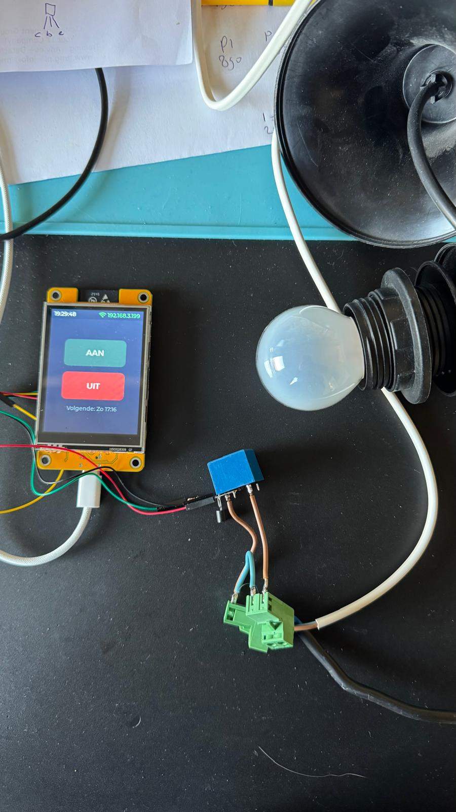
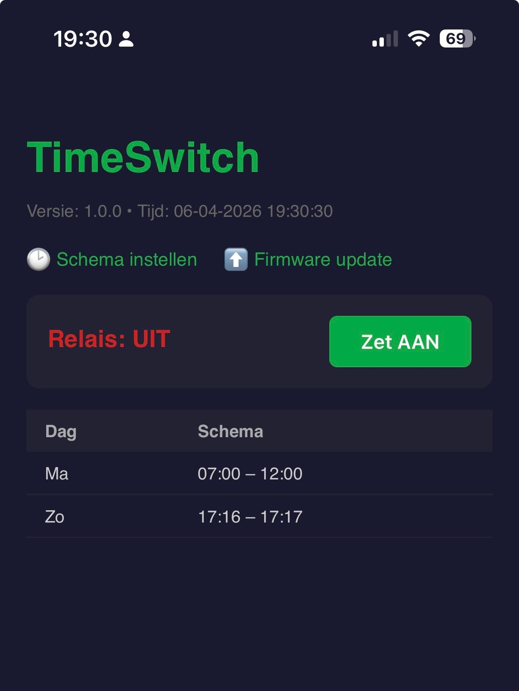
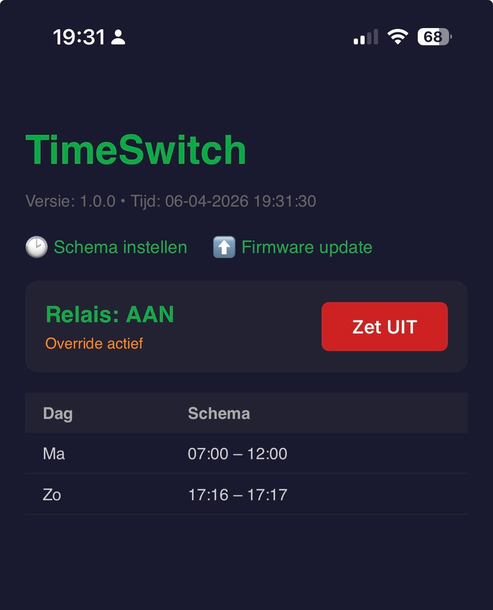
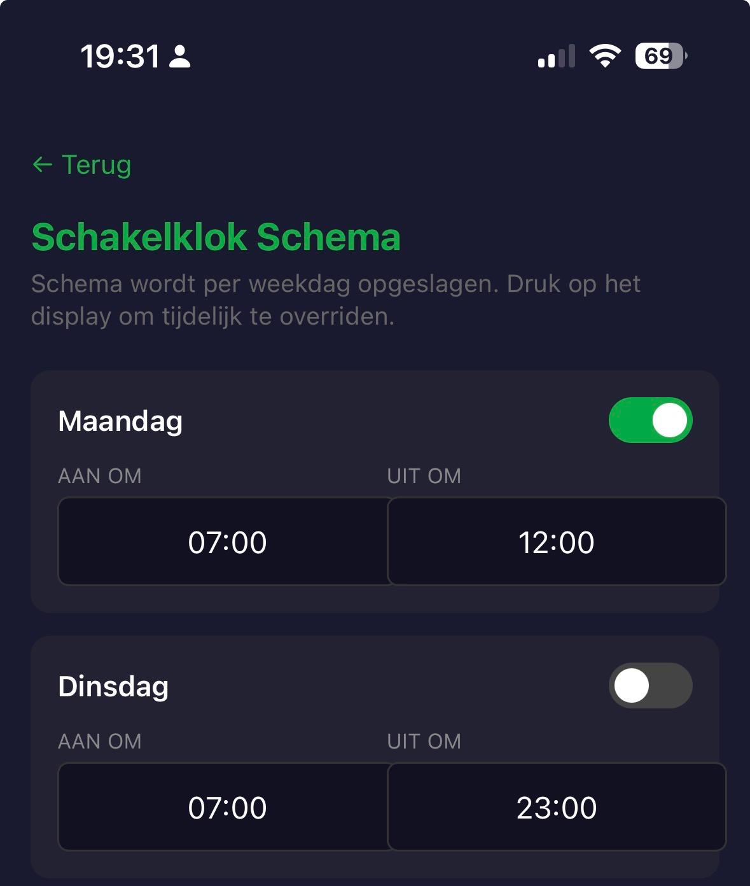

# TimeSwitch

 
 

Schakelklok voor ESP32 met touchscreen. Stuurt een relais aan op basis van een instelbaar weekschema.



## Web UI

| Relais UIT                                | Relais AAN (override)                     | Schema instellen                        |
| ----------------------------------------- | ----------------------------------------- | --------------------------------------- |
|  |  |  |

## Functies

- Relais aan/uit via touchscreen én webbrowser
- Per dag instelbaar schema (Ma t/m Zo) met aan- en uitschakeltijd, opgeslagen in NVS
- Override: handmatige bediening (display of web) negeert het schema tot de volgende schema-overgang; terugzetten naar de schema-staat heft de override direct op
- Display en web UI zijn altijd synchroon — wijziging via web volgt direct op de display
- Automatische tijdsynchronisatie via NTP (CET/CEST tijdzone)
- WiFi configuratie via captive portal (geen hardcoded credentials)
- Schema instellen via webbrowser (`http://<ip>/schedule`)
- Relais bedienen via webbrowser (`http://<ip>/`)
- OTA firmware-update via webbrowser (`http://<ip>/update`)
- Touch kalibratie met opslag in NVS; opnieuw kalibreren via Systeemtab

## Hardware

| Component | Details                          |
| --------- | -------------------------------- |
| Board     | ESP32-2432S028R (Sunton "CYD")   |
| MCU       | ESP32-D0WDQ6 (240MHz dual-core)  |
| Display   | 2.8" ST7789, 240×320, SPI        |
| Touch     | XPT2046, SPI                     |
| Relais    | GPIO3 (RXD0)                     |

## Pinout

### Display (SPI2)

| Signaal   | GPIO |
| --------- | ---- |
| CLK       | 14   |
| MOSI      | 13   |
| MISO      | 12   |
| DC        | 2    |
| CS        | 15   |
| Reset     | 4    |
| Backlight | 21   |

### Touch (SPI3)

| Signaal | GPIO |
| ------- | ---- |
| CLK     | 25   |
| MOSI    | 32   |
| MISO    | 39   |
| CS      | 33   |
| IRQ     | 36   |

### Relais

| Signaal | GPIO |
| ------- | ---- |
| Relais  | 3    |

## Projectstructuur

```text
main/
├── main.c              entry point, schema-check loop, override-logica
├── hardware.h          GPIO- en display-constanten
├── Kconfig.projbuild
├── lcd/                display driver + LVGL init
├── touch/              XPT2046 driver
├── touch_cal/          touch kalibratie (NVS)
├── relay/              relais aansturing
├── settings/           NVS opslag (weekschema per dag)
├── wifi/               WiFi manager + captive portal
├── time/               NTP synchronisatie (CET/CEST)
├── ota/                OTA firmware-update server
└── ui/                 LVGL interface (tabview)
    ├── ui_main         statusbalk + tabview shell + schema-statustimer
    └── ui_relay        relais toggle knop + override-feedback
```

## Bouwen

Vereist ESP-IDF v5.2 of hoger.

```bash
idf.py build
idf.py flash monitor
```

## Eerste opstart

1. Automatisch kalibratiescherm: tik de 4 kruispunten aan
2. Geen WiFi ingesteld: verbind met `TimeSwitch-Setup` en open `http://192.168.4.1`
3. Vul SSID en wachtwoord in — apparaat herstart en verbindt
4. Tijd wordt automatisch gesynchroniseerd via NTP

## Schema instellen

Ga in de browser naar `http://<ip-adres>/schedule`. Het IP-adres is zichtbaar in de statusbalk bovenaan het display.

Per dag (Ma t/m Zo) is in te stellen:

- Aan/uit inschakelen voor die dag
- Aan-tijd en uit-tijd

## Relais bedienen via web

Ga naar `http://<ip-adres>/`. De statuspagina toont de huidige relaisstatus en een knop om te schakelen. Override-status is zichtbaar en de display-knop volgt direct mee.

## OTA update

Ga naar `http://<ip-adres>/update` en upload een nieuw `.bin` bestand. Het apparaat herstart automatisch na een succesvolle update.

## Override-gedrag

- Schakelen (display of web) terwijl schema iets anders zegt → **override actief** (statuslabel toont wanneer override eindigt)
- Terugzetten naar de schema-staat (display of web) → **override direct opgeheven**
- Override eindigt automatisch bij de volgende schema-overgang
- Display en web UI zijn altijd synchroon

## Opnieuw kalibreren

Wis de NVS-partitie via `idf.py erase-flash` of via het `idf.py` monitor commando. Het kalibratiescherm verschijnt automatisch bij de volgende opstart als er geen geldige kalibratie aanwezig is.
